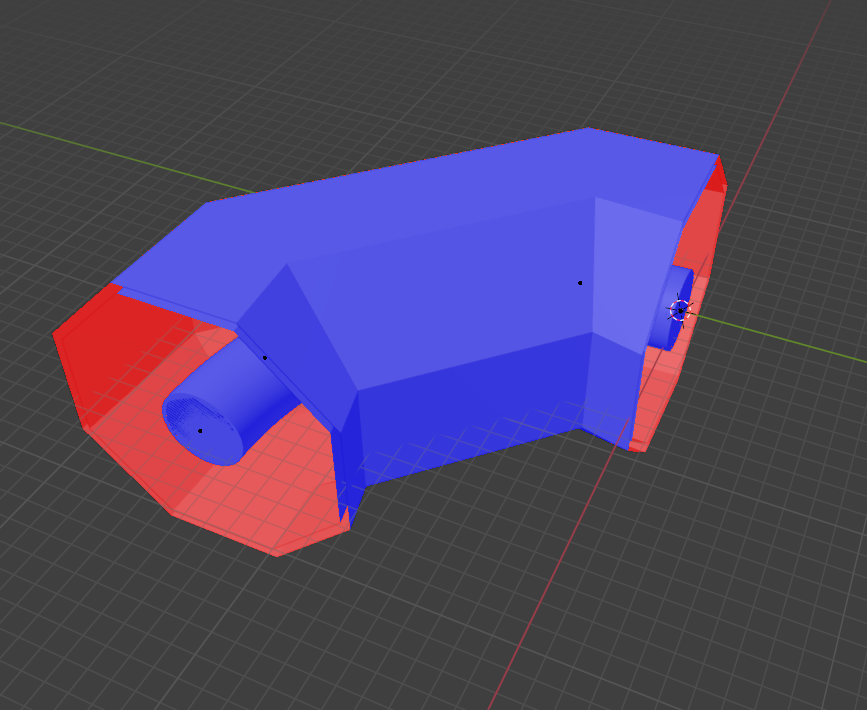

# Laser Cross Calibration

A precision laser cross-calibration system for volumetric PIV (Particle Image Velocimetry) camera calibration using ray tracing through complex optical geometries. 

## Concept
The laser cross calibration works by moving the intersection point of two laser beams through a volume. By taking pictures and knowing the world space location of the intersection, this information can be used for camera calibration. This method has the advantage of being non-invasive. For simple configurations, e.g. a beam at an angle through a flat surface, the intersection can be calculated easily. However, more complex systems require the aid of non-sequential raytracing. The goal is to provide a good estimation of the intersection point in world coordinates to create an initial calibration which can subsequently be refined using _Volume-Self-Calibration_ or similar methods. 

## Goal
The goal of this package is to create a flexible module for tracing a limited number of rays through an optical system in non-sequential order.
Optical systems are defined as interfaces with a geometry and optical material properties. Geometries can be built from various primitives or loaded as STL files. For STL meshes, the number of triangles limits the final precision. Smooth normal vector calculation is supported for better approximation of curved objects.

The primary use case is a dual-beam laser stage where the beams are supposed to intersect within the domain. By specifying a point of intersection, the required stage position is derived via inverse optimization. The approach uses a two-step method: first, the volume is sampled and a regressor is trained to provide a rough initial guess. This guess is then used in a second optimization step using the `scipy.optimize` module for final position estimation.

A planned `gcode` subpackage will transform the calculated stage positions into G-code files ready for execution in real-world applications.


## Surface Normal and Material Logic

This system uses a pure interface-based approach for optical ray tracing, where materials are defined at interfaces rather than as ambient media.

### Interface Material Definition

Each `OpticalInterface` defines two materials:
- **`material_pre`**: Material on the incoming side (where the ray approaches from)
- **`material_post`**: Material on the transmitted side (where the ray continues into)

The **surface normal direction** is critical and points **from `material_post` toward `material_pre`** (outward from the transmitted medium):

```
material_pre  <-  [Interface]  <-  material_post
     air      <-  (surface)   <-      glass
                     <-
            normal points outward
```

### Checking Surface Normals in Blender

When working with STL files in Blender, you can visualize surface normals to ensure correct material assignment:



**Steps to check normals in Blender:**

1. **Import your STL file**: `File -> Import -> STL`
2. **Enter Edit Mode**: Select object, press `Tab` or click "Edit Mode"
3. **Enable face normal display**:
   - Open overlay options (overlapping circles icon in top-right)
   - Check "Face Orientation" to see red/blue faces
   - Check "Normals" and set to "Face" to see normal vectors
4. **Verify normal direction**:
   - Blue faces = normals pointing toward camera (outward)
   - Red faces = normals pointing away from camera (inward)
   - Normal arrows show exact direction

**Correct normal orientation for optical interfaces:**
- Normal points FROM `material_post` TOWARD `material_pre` (outward from transmitted medium)
- Air-to-glass interface: normal points toward air (outward from glass)
- Glass-to-air interface: normal points toward glass (outward from air)

### Ray Tracing Logic

When a ray hits an interface:

1. **Determine current medium**: Based on the ray's travel history
2. **Check approach direction**: Compute dot product of ray direction with surface normal
3. **Apply refraction**: Use Snell's law with `material_pre` and `material_post` refractive indices
4. **Update ray medium**: Ray continues in the appropriate material based on the interface definition

This interface-based approach eliminates ambiguity about "ambient" materials and provides physically accurate ray propagation through complex optical systems.
