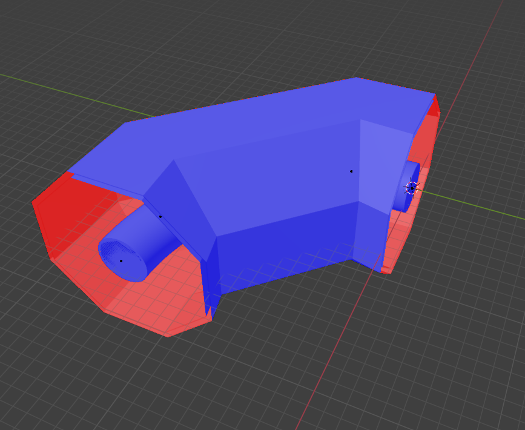

# Laser Cross Calibration

A Python framework for non-sequential optical ray tracing, built to calibrate volumetric PIV (Particle Image Velocimetry) cameras via laser cross-calibration. It includes hardware control for driving a motorized dual-laser stage.

> **Status:** Research-grade, actively used at IMFD. Core ray tracing, materials, geometry, and optimization are stable. Some workflow steps (see [Known Gaps](#known-gaps)) still require manual glue code — see [Project Status](#project-status).

## Table of Contents

- [Concept](#concept)
- [Project Status](#project-status)
- [Repository Layout](#repository-layout)
- [Installation](#installation)
- [Core Concepts](#core-concepts)
- [Quickstart](#quickstart)
- [Inverse Optimization (Stage Positioning)](#inverse-optimization-stage-positioning)
- [Pipe Center Finder](#pipe-center-finder)
- [Hardware Control (`lcc-control-gui`)](#hardware-control-lcc-control-gui)
- [Development](#development)
- [Validation](#validation)
- [Known Gaps](#known-gaps)
- [License](#license)

## Concept

Laser cross calibration determines the 3D world position of the point where two laser beams intersect, and uses that as a calibration reference for cameras. By moving the intersection point through a measurement volume and photographing it, camera calibration can be performed without physically inserting a target into the flow — which matters when the target volume is a closed vessel, a pressurized cell, or otherwise hard to access.

For a beam through a single flat window, the intersection point can be computed analytically. Real setups usually involve several refractive interfaces (tank walls, immersion fluid, cylindrical windows, curved geometry), where refraction at each interface shifts the intersection unpredictably. This package solves that with **non-sequential ray tracing**: rays are propagated through an arbitrary set of optical interfaces, refracting or reflecting at each one according to Snell's law, until they either exit the system or run out of interfaces to hit.

The output is an estimate of the intersection point in world coordinates, accurate enough to serve as an initial calibration that can be refined with volume self-calibration or similar downstream methods.

## Project Status

| Area | State |
|---|---|
| Ray tracing engine (`tracing/`) | Stable, used in production |
| Surfaces: plane, cylinders, triangulated STL (`surfaces/`) | Stable |
| Materials: constant index, Sellmeier glass, mixtures (`materials/`) | Stable |
| Laser sources: single beam, dual-beam stage (`sources/`) | Stable |
| Inverse optimization (target point → stage position) (`optimization/`) | Working, see `examples/advanced-curved-geometry.ipynb` |
| Pipe center finder (`geometry/`) | Working, used for post-hoc pipe geometry extraction |
| Visualization (`visualization/`) | Working (Plotly-based interactive scenes) |
| Hardware control GUI (`lcc-control-gui/`) | Functional, production-tested with Marlin firmware |
| G-code generation from optimization results | Manual bridge only, no library API — see [Known Gaps](#known-gaps) |

Validated against published experimental data (Gunady et al., 2024) — see [Validation](#validation).

## Repository Layout

```
src/laser_cross_calibration/   Core ray tracing library (this package)
├── tracing/                   OpticalSystem, OpticalInterface, OpticalRay, RayTracer
├── surfaces/                  Plane, cylinders, triangulated (STL) surfaces
├── materials/                 Refractive index models + material registry
├── sources/                   Laser beam source definitions
├── optimization/              Inverse kinematics (target point -> stage position)
├── geometry/                  Pipe center finder (chord-fitting geometry)
└── visualization/             Plotly-based 3D scene rendering

lcc-control-gui/                Separate installable package (uv workspace member)
├── src/lcc_control_gui/       PySide6 GUI + StageController for Marlin-based stages
├── firmware/                  ESP32/Arduino mock Marlin firmware for testing without hardware
└── README.md                  Full GUI usage guide — read this before running the stage

examples/                       Jupyter tutorials
├── introduction-tutorial.ipynb  Start here: flat-plate system, Gunady et al. validation
├── advanced-curved-geometry.ipynb  STL geometry, sampling + Optimizer, calibration grid, G-code
└── stl-files/                  Example STL geometry used by the notebooks above

tests/                          pytest suite for the core library
```

## Installation

Requires **Python ≥ 3.12**. The project uses [uv](https://docs.astral.sh/uv/) and is set up as a workspace with `lcc-control-gui` as a member, so a single `uv sync` installs both the ray tracing library and the GUI:

```bash
git clone git@gitlab.hrz.tu-chemnitz.de:fluid-imfd/experiment/laser-cross-calibration.git
cd laser-cross-calibration
uv sync
```

To also pull the optional example-notebook dependency (mermaid diagram rendering):

```bash
uv sync --extra examples
```

Without `uv`, a standard editable install also works:

```bash
pip install -e .
pip install -e ./lcc-control-gui   # only if you need the hardware GUI
```

The core library depends on [`hazy-frames`](https://pypi.org/project/hazy-frames/) (published on PyPI) for coordinate frame management — no separate setup needed, it installs like any other dependency.

## Core Concepts

### Interfaces, not ambient media

Rather than tracking "what medium is the ray currently in" globally, every `OpticalInterface` explicitly names the material on both sides:

```python
OpticalInterface(
    geometry=plane_surface,
    material_pre=lcc.materials.AIR,             # side the ray approaches from
    material_post=lcc.materials.GLASS_FUSED_SILICA,  # side the ray continues into
)
```

**The surface normal must point from `material_post` toward `material_pre`** — i.e., outward from the transmitted medium:

Requires Python >= 3.12. Managed with [uv](https://docs.astral.sh/uv/).

```bash
# Install the core library in development mode
uv sync

# Optionally install the control GUI
uv pip install -e ./lcc-control-gui

# Install example notebook dependencies
uv sync --extra examples
```

This resolves what would otherwise be ambiguous for nested surfaces or re-entrant geometry, and matches how optical engineers usually reason about coatings and interfaces. Getting a normal backwards is the most common source of "rays refract the wrong way" bugs — when working from STL files, check normals visually in Blender before importing:



<details>
<summary>Checking normals in Blender</summary>

1. **Import your STL file**: `File -> Import -> STL`
2. **Enter Edit Mode**: select the object, press `Tab`
3. **Enable face orientation overlay**: overlay options (top-right) → check "Face Orientation"
   - Blue faces = normal points toward camera (outward)
   - Red faces = normal points away from camera (inward)
4. Optionally enable "Normals" → "Face" to see the actual vectors

For an air-to-glass interface, the normal should point toward air (outward from glass); for glass-to-air, toward glass.
</details>

### Building blocks

| Concept | Class | Role |
|---|---|---|
| Geometry | `Surface` (`Plane`, `InfiniteCylinder`, `FiniteCylinder`, `EllipticCylinder`, `TriSurface`) | Shape and location of a boundary. `TriSurface` loads STL meshes, with optional smooth (Gouraud-style) normal interpolation. |
| Material | `BaseMaterial` (`ConstantMaterial`, `SellmeierGlass`, `WaterGlycerolMixture`) | Refractive index, optionally wavelength-dependent. Look one up from the built-in registry via `lcc.materials.get_material("BK7")`. |
| Interface | `OpticalInterface` | Pairs a `Surface` with `material_pre` / `material_post`. |
| System | `OpticalSystem` | Container for all interfaces a ray can hit. `final_propagation_distance` controls how far rays travel after the last interface, so intersections downstream can still be found. |
| Source | `LaserSource` (`SingleLaserSource`, `DualLaserStageSource`) | Where beams originate. `DualLaserStageSource` models two beams fixed to a common stage origin (`arm1`/`arm2` offsets, one direction each) — the actual use case for cross-calibration. |
| Tracer | `RayTracer` | Traces sources through a system non-sequentially (closest-hit-first) and locates beam intersections. |
| Scene | `Scene` | Interactive Plotly 3D visualization of systems, sources, traced rays, and points. |

Coordinate handling goes through [`hazy`](https://pypi.org/project/hazy-frames/) (`Frame`, `Point`, `Vector`), which enforces which frame a quantity is expressed in and handles the transformations between stage, laser, and world frames automatically.

## Quickstart

This reproduces the core of `examples/introduction-tutorial.ipynb` (a glass plate submerged in water, dual-laser stage 30 cm away):

```python
from math import radians, sin, cos
import laser_cross_calibration as lcc
from hazy import Frame

# 1. Build the optical system: two interfaces forming a 1 cm glass plate in water
system = lcc.tracing.OpticalSystem(final_propagation_distance=10)
root = Frame(name="root")
surface_frame = root.make_child(name="Surface Frame")

front = lcc.tracing.OpticalInterface(
    geometry=lcc.surfaces.Plane(point=surface_frame.origin, normal=surface_frame.y_axis),
    material_pre=lcc.materials.AIR,
    material_post=lcc.materials.GLASS_FUSED_SILICA,
)
back = lcc.tracing.OpticalInterface(
    geometry=lcc.surfaces.Plane(
        point=surface_frame.origin + surface_frame.y_axis * 0.01, normal=surface_frame.y_axis
    ),
    material_pre=lcc.materials.GLASS_FUSED_SILICA,
    material_post=lcc.materials.WATER,
)
system.add_interface(front)
system.add_interface(back)

# 2. Define the dual-laser stage source (child of the same root frame)
stage_frame = root.make_child(name="Stage Frame")
alpha, beta = radians(11.5), radians(12.6)
source = lcc.sources.DualLaserStageSource(
    origin=stage_frame.origin - stage_frame.y_axis * 0.3,
    arm1=stage_frame.x_axis * 0.1,
    arm2=-stage_frame.x_axis * 0.1,
    direction1=stage_frame.vector(-sin(alpha), cos(alpha), 0.0),
    direction2=stage_frame.vector(sin(beta), cos(beta), 0.0),
)

# 3. Trace and find where the beams cross
tracer = lcc.tracing.RayTracer().add_optical_system(system=system)
rays, intersections = tracer.trace_and_find_crossings(sources=[source])
print(intersections[0])  # world-frame (x, y, z) of the beam crossing

# 4. Visualize (optional)
scene = lcc.visualization.Scene()
scene.add_system(system)
scene.add_source(source)
scene.add_rays(rays=rays)
scene.make_figure()
```

For the full walkthrough (including moving the stage and validating against Gunady et al.'s published scaling factor), see `examples/introduction-tutorial.ipynb`.

## Inverse Optimization (Stage Positioning)

Tracing answers "given a stage position, where do the beams cross?" The `optimization` module answers the inverse: **given a target 3D point, what stage position produces it?**

```python
from laser_cross_calibration.optimization import GradientBoostingEstimator, Optimizer

# Estimator gives a fast initial guess (train it on sampled stage-position -> intersection data first)
estimator = GradientBoostingEstimator(frame=stage_frame).fit(X=sampled_targets, y=sampled_origins)

optimizer = Optimizer(tracer=tracer, estimator=estimator)
result = optimizer.find_source_origin(target=target_point, source=source)
# result.x -> stage origin (Point) that places the intersection at `target`, to within ~1 µm
```

Internally this is two-phase: a gradient-boosting regressor trained on sampled `(target, stage_origin)` pairs gives a coarse initial guess, then `scipy.optimize.minimize` (Nelder-Mead — gradient-free) refines it to the tolerances defined on `Optimizer` (`POSITION_TOLERANCE`, `ERROR_TOLERANCE`).

`examples/advanced-curved-geometry.ipynb` walks through the full workflow end to end: sampling a stage's reachable volume, training the estimator, refining with `Optimizer`, generating a snake-ordered calibration grid, and exporting G-code.

## Pipe Center Finder

`laser_cross_calibration.geometry.PipeCenterFinder` fits chord-length data (from laser-cross intersections recorded at different z positions inside a cylindrical pipe) to recover the pipe's centerline, using a parabolic fit of chord-length² vs. z rather than a direct ellipse fit — this avoids the numerical degeneracy that direct ellipse fitting runs into near-circular cross-sections. Uncertainty is propagated through via the `uncertainties` package, so results carry error bars derived from the input measurement noise.

## Hardware Control (`lcc-control-gui`)

A separate installable package (uv workspace member) providing a PySide6 GUI and a `StageController` class for driving a Marlin-firmware-based motion stage (standard 3D-printer firmware/G-code) over serial. It can be used headless for scripted moves, or through the GUI for manual jogging and G-code file execution. Jupyter notebooks are also a great way for interactive control and looping through positions.

**See [`lcc-control-gui/README.md`](lcc-control-gui/README.md) for installation, first-time setup, and the scripting API** — it's kept up to date independently since it has its own release cycle within the workspace.

A mock Marlin firmware for an ESP32/Arduino is included in `lcc-control-gui/firmware/`, useful for testing the GUI/controller without physical hardware attached.

## Development

```bash
uv sync                       # installs dev dependency group (pytest, ruff, pre-commit, ...)
uv run pytest                 # core library tests
uv run pytest --cov           # with coverage (see pyproject.toml [tool.coverage])
cd lcc-control-gui && uv run pytest tests/   # GUI package has its own test suite
uv run ruff check .
pre-commit install            # enable lint/format hooks before committing
```

Test markers `unit`, `integration`, and `slow` are registered in `pyproject.toml` and can be selected with `pytest -m <marker>`.

There is no CI pipeline configured yet — tests and linting are currently run locally / via pre-commit hooks only.

## Validation

The framework's ray tracing has been validated against the experimental setup published by Gunady et al. (2024, [DOI: 10.1088/1361-6501/ad574d](https://iopscience.iop.org/article/10.1088/1361-6501/ad574d)): a dual-laser stage at fixed angles (11.5° / 12.6°) shining through a fused-silica plate into water. The published relationship between stage displacement and intersection-point displacement is a scaling factor of **1.34**; the simulation reproduces **1.343** (R ≈ 1.0), see `examples/introduction-tutorial.ipynb`.

## Known Gaps

Things a new maintainer should be aware of before assuming the pipeline is end-to-end automated:

- **No first-class G-code generator.** `Optimizer.find_source_origin` returns stage positions, but nothing currently converts a list of those into a `.gcode` file for `StageController.run_gcode_file` as a proper library function — `examples/advanced-curved-geometry.ipynb` shows the manual bridge (convert to machine coordinates via one measured reference point, wrap in dwell/trigger G-code), but it's still copy-paste-and-adapt per experiment, not an API.
- **No example notebook for the `geometry` module** (`PipeCenterFinder`). Tracing and optimization are both covered end-to-end in `examples/`.
- **No LICENSE file yet.** The maintainer intends MIT (all code is original or built on permissively-licensed dependencies) but this hasn't been formally added — do this before sharing the repository outside the institute.
- **No CI.** Linting and tests are enforced via local pre-commit hooks only; nothing runs automatically on push/merge requests.
- **No partial reflection / beam splitting.** `OpticalRay.refract` is a hard either/or: below the critical angle the ray fully refracts (100% transmission assumed, no Fresnel reflectance computed at all), above it the ray fully reflects (total internal reflection). Real interfaces always partially reflect some of the incident beam too, even below the critical angle — that portion is currently discarded rather than traced as a second, lower-intensity ray, and `OpticalRay` has no intensity/amplitude field to represent it if it were. Doesn't affect the primary calibration use case (only the dominant transmitted beam matters for finding the crossing point), but would matter for stray-light or ghost-reflection analysis.

## License

MIT (intended — see [Known Gaps](#known-gaps); no `LICENSE` file has been added to the repository yet).
